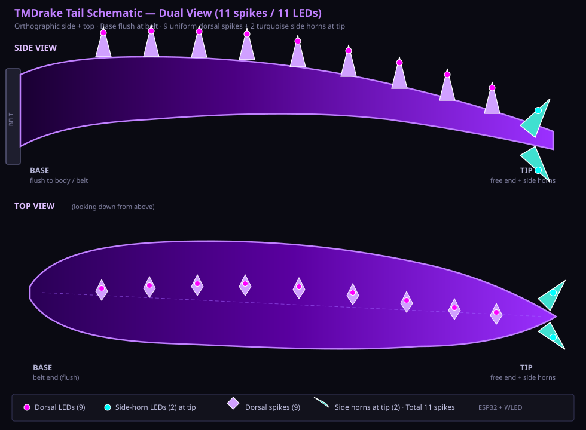
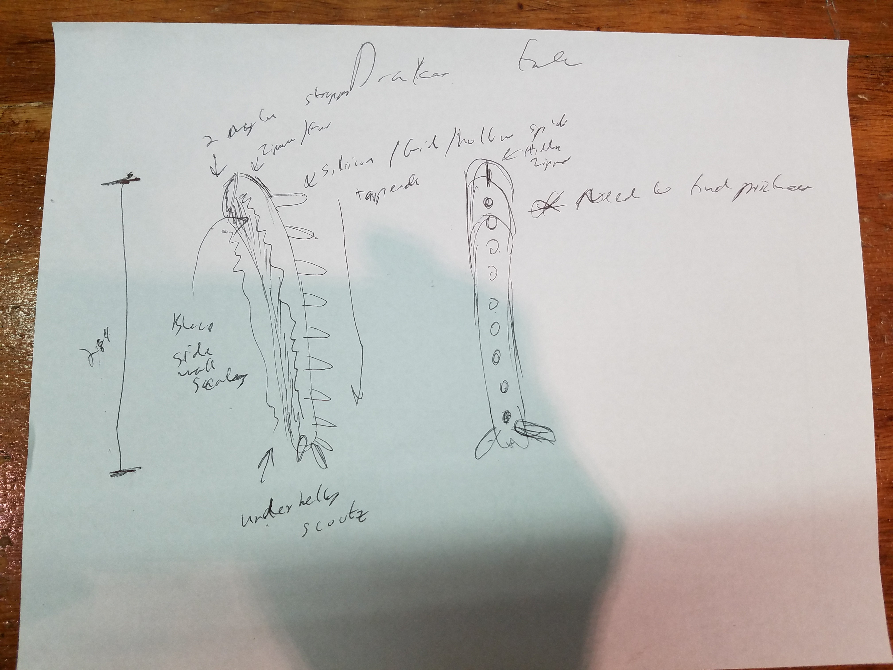
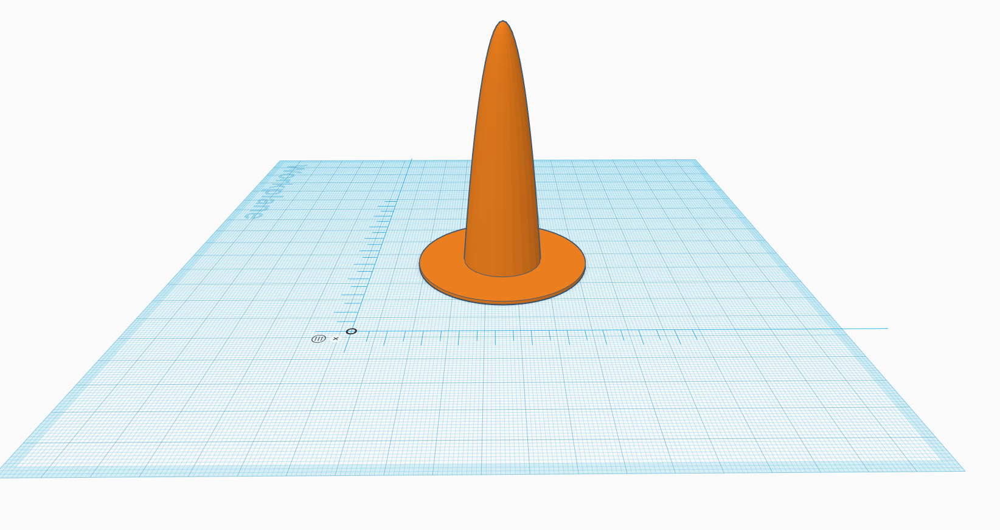
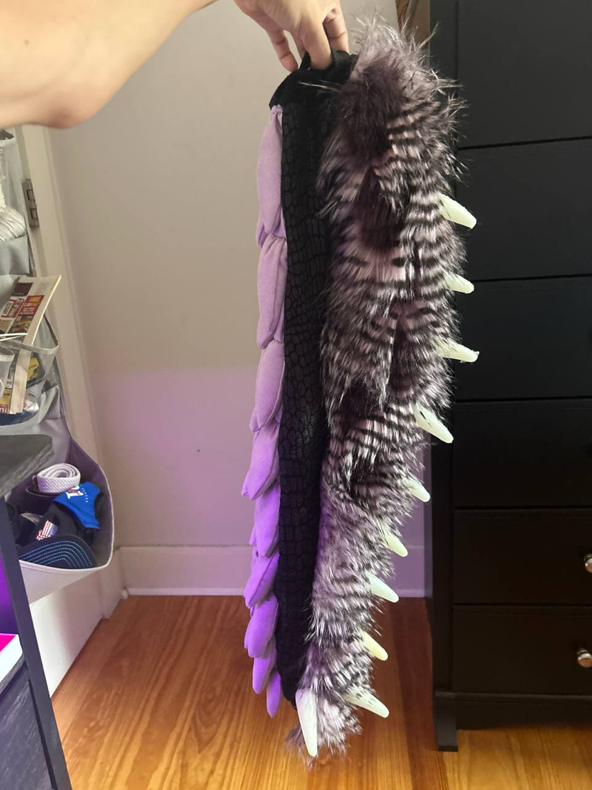
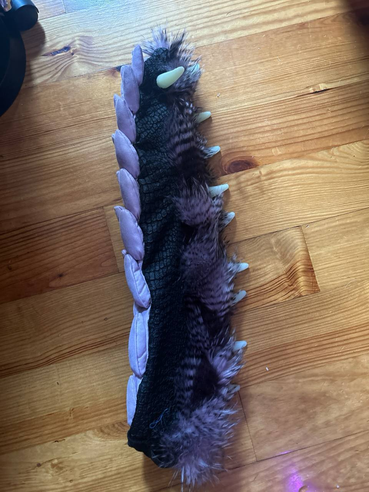

# TMDrake Tail Project

Open-source purple tech-dergy fursuit tail.

**Long lost tail, several makers later... just gonna open source it.**

## Features
- Sturdy construction (designed to flip inside-out)
- 7 dorsal spikes + 2 side horns
- 9× WS2812B LEDs (ESP32 + WLED)
- Motion-reactive via MPU-6050
- Android app control through WLED

## Diagrams & Photos

### Latest assembly finish (2026-07-30)

## Contents
- Spike STLs (`Tailspike-*.stl`)
- Reference photos & fabric links
- `tail-schematic.svg` — LED/spike layout
- `DESIGN_NOTES.md` — lighting, sensors, construction notes
- `TODO.txt` — remaining pattern & documentation work
- Latest finish photos currently in root (intended home: `2024 project/`)

## Status
Almost assembled. Lighting + sensors + app control next.

MIT License · Drake Dragon
